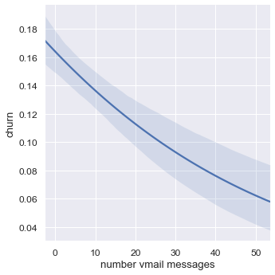
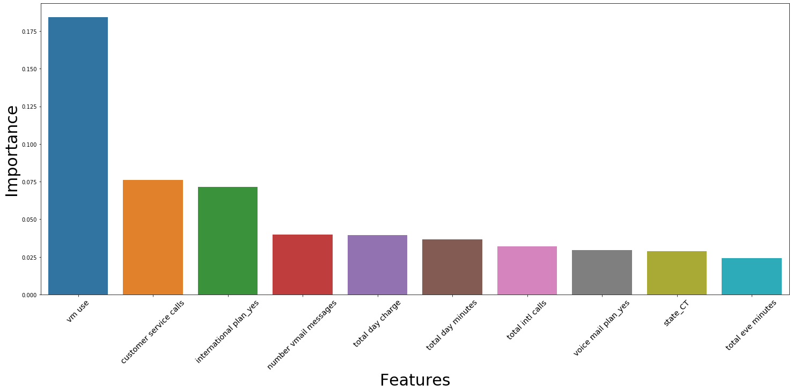

# Classification Project - Telecom Churn Rates
- Wayne Lam
- Object Oriented Approach to Classification Project (classification_funcs.py)

## Data
- From https://www.kaggle.com/becksddf/churn-in-telecoms-dataset
- Evaluating features (variables) in telecom service that correlate with churn (unsubscribing from a service)
- 20 initial features
- 3333 data points
- High class (churn vs. no churn) imbalance with churn being approximately 14.5% and not churn 85.5% of data points

## EDA / Data Visualization
- Several fairly prominent features: voicemail messages, total minutes across day/evening/night/international, total customer service calls
- Colinearity between total minutes and total charges across day/evening/night/international
- Having voicemail messages and not having voicemail messages also strongly correlated with churn rate, chi-squared well over critical value from alpha = 0.05

## Feature Engineering and Selection
- Features removed include phone number (identifying information/unnecessary), total charges (except international) removed by XGBoost (scores of 0 in feature importance)
- Categorical variables area code and state have been dummied with the initial features dropped

## Model Selection and Evaluation
- F1 score for evaluation since accuracy may not reflect predictive strength of a model due to high class imbalance
- XGBoost w/GridSearch CV, RandomForest w/GridSearch CV, AdaBoost used
- With XGBoost w/GridSearch CV, initial pass used to remove "unimportant" features and second pass used for tuning hyperparameters
- XGBoost had the highest F1 score: 0.854

## Insights and future investigation
- Tiered payment plan (possible unlimited plan), higher minutes increased churn rate
- Possibly opt in voicemail plan (maybe default plan) since excess charge for individuals who do not use voicemail may turn to other plans
- Future considerations: VM plan and if customer uses it, text and data plans (if the data is available)
